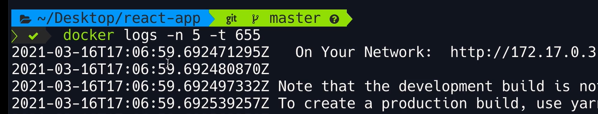

# Docker
Docker

Docker File:

+ FROM
+ WORKDIR
+ COPY
+ ADD
+ RUN 
+ ENV
+ EXPOSE
+ USER
+ CMD
+ ENTRYPOINT

# Image OS

# Programing Language

+ https://hub.docker.com/

+ Select Image : ex. Node
Exist different version that you can choose.


Select: 14.16.0-alpine3.13

Create Docker file to load node in linux alpine distribution


Load Image Apline with Node


verify image created.


Get in to image Node in 14.16.0-alpine3.13


Node JS is working but alpine has not bash installed.


In this part the containers is created generating un coker ignore to discard some files in the deployment. As well we created a environment variable and active in port 3000 in the host machine the access to this container.


# Create User

+ when you are working with container is a good practice create a user system to deploy the solution.

Commnand:
+ Create group "app"
$ addgroup app
+ Create user "app" 
  - Format: adduser -S -G [group] [user]
$ adduser -S -G app app
+ Verify:
$ groups app
app

Note: Best practice use name "app"

To send the same instrauction use this command:
$ addgroup app && adduser -S -G app app
$ groups app

 

``` docker
FROM node:14.16.0-alpine3.13
RUN addgroup app && adduser -S -G app app
USER app
WORKDIR /app
COPY package*.json .
RUN npm install

COPY . .
RUN npm install

ENV API_URL=http://api.myapp.com
EXPOSE 3000
# shell form
# /bin/sh
# cmd
# CMD npm start

# Exec form
CMD ["npm", "start"]
```

# Analys each instruction

$ docker history react-app


# Remove Docker Image

In this section you can see how to remove an image.

``` bash

@ERICK-ZABALA ➜ /workspaces/Docker (main) $ docker images
REPOSITORY   TAG       IMAGE ID       CREATED              SIZE
react-app    latest    1a3dca5802c2   About a minute ago   117MB
<none>       <none>    009a81f05439   17 minutes ago       117MB
<none>       <none>    5065de1fec11   40 minutes ago       117MB
<none>       <none>    34870cf3b371   2 years ago          117MB
@ERICK-ZABALA ➜ /workspaces/Docker (main) $ docker image prune
WARNING! This will remove all dangling images.
Are you sure you want to continue? [y/N] y
Total reclaimed space: 0B
@ERICK-ZABALA ➜ /workspaces/Docker (main) $ docker images
REPOSITORY   TAG       IMAGE ID       CREATED          SIZE
react-app    latest    1a3dca5802c2   2 minutes ago    117MB
<none>       <none>    009a81f05439   18 minutes ago   117MB
<none>       <none>    5065de1fec11   41 minutes ago   117MB
<none>       <none>    34870cf3b371   2 years ago      117MB
@ERICK-ZABALA ➜ /workspaces/Docker (main) $ docker container prune
WARNING! This will remove all stopped containers.
Are you sure you want to continue? [y/N] y
Deleted Containers:
dc754ce52c395762de9e98f9bcc536d3fdff8e0f3d6b19530d6bb16a0fa14fb1
d263ee9faea878f3bf079961bc4d1a75a9f0338c665c72f57e381dab0449c606
3ab3ea0ab93b323760af89c865b1d475dc210f0e0fada6ea618e407c565c3633
67591ccf9beb98aeaee22f454eedd280caf3dce32d5979a1fc9352fc6538e9c4
253b7773c5f306dad6f41a8c94dd792e80a658e2d1232bc00ec0af52e5603186
04b604c596c9ba69fea97c9f09c2e9f69f715d6d2425703e08fa50835014ad0b
514b9d1b4cb118b3271f7462dfcafd58bdb55c6087ac408511282f6555c2e0fa
5b9ad4eb14310d5aadeeed735d8feed2505251b8fcb00133e2ef6e078990cd57

Total reclaimed space: 867B
@ERICK-ZABALA ➜ /workspaces/Docker (main) $ ps -a
    PID TTY          TIME CMD
  48329 pts/0    00:00:00 ps
@ERICK-ZABALA ➜ /workspaces/Docker (main) $ docker image prune
WARNING! This will remove all dangling images.
Are you sure you want to continue? [y/N] y
Deleted Images:
deleted: sha256:34870cf3b3717b4e748082818760cf16761ff1ea1c9c8f8dd913fbead565ed85
deleted: sha256:5065de1fec1186cf122d5bf582df8ebd9ef0ab451e5ac2439712c051636a8ca5
deleted: sha256:009a81f054396cadb426d24021f8267929845360496cad7e15c389bae318bd14

Total reclaimed space: 0B
@ERICK-ZABALA ➜ /workspaces/Docker (main) $ docker images
REPOSITORY   TAG       IMAGE ID       CREATED         SIZE
react-app    latest    1a3dca5802c2   4 minutes ago   117MB
@ERICK-ZABALA ➜ /workspaces/Docker (main) $ docker image rm 1a3
Untagged: react-app:latest
Deleted: sha256:1a3dca5802c26549edb929c9d6085698f6951680a16adec409be8eab33f9d53c
@ERICK-ZABALA ➜ /workspaces/Docker (main) $ 
```
# Tag Images

+1st Option:

```bash
@ERICK-ZABALA ➜ /workspaces/Docker (main) $ docker build -t react-app:1 .
[+] Building 3.1s (11/11) FINISHED                                                          docker:default
 => [internal] load build definition from Dockerfile                                                  0.1s
 => => transferring dockerfile: 282B                                                                  0.0s
 => [internal] load .dockerignore                                                                     0.1s
 => => transferring context: 59B                                                                      0.0s
 => [internal] load metadata for docker.io/library/node:14.16.0-alpine3.13                            0.2s
 => [auth] library/node:pull token for registry-1.docker.io                                           0.0s
 => [1/5] FROM docker.io/library/node:14.16.0-alpine3.13@sha256:2c51dc462a02f15621e7486774d36d048a27  0.0s
 => [internal] load build context                                                                     0.0s
 => => transferring context: 7.61kB                                                                   0.0s
 => CACHED [2/5] RUN addgroup app && adduser -S -G app app                                            0.0s
 => CACHED [3/5] WORKDIR /app                                                                         0.0s
 => [4/5] COPY . .                                                                                    0.2s
 => [5/5] RUN npm install                                                                             1.1s
 => exporting to image                                                                                1.1s
 => => exporting layers                                                                               1.1s
 => => writing image sha256:f9b4559f5cc3201914214b00af26915ceaffe6b022fda51b36cd25b70963e55c          0.0s
 => => naming to docker.io/library/react-app:1                                                        0.0s
@ERICK-ZABALA ➜ /workspaces/Docker (main) $ docker images
REPOSITORY   TAG       IMAGE ID       CREATED         SIZE
react-app    1         f9b4559f5cc3   6 seconds ago   117MB
@ERICK-ZABALA ➜ /workspaces/Docker (main) $ 
```
+ 2nd Option


# Sharing Images

+ Create Repository:


```bash
@ERICK-ZABALA ➜ /workspaces/Docker (main) $ docker images
REPOSITORY   TAG       IMAGE ID       CREATED          SIZE
react-app    1         f9b4559f5cc3   10 minutes ago   117MB
@ERICK-ZABALA ➜ /workspaces/Docker (main) $ docker image tag f9b erickzabala
@ERICK-ZABALA ➜ /workspaces/Docker (main) $ /
bash: /: Is a directory
@ERICK-ZABALA ➜ /workspaces/Docker (main) $ docker image tag f9b erickzabala/react-app:2.0.0
@ERICK-ZABALA ➜ /workspaces/Docker (main) $ docker images
REPOSITORY              TAG       IMAGE ID       CREATED          SIZE
erickzabala/react-app   2.0.0     f9b4559f5cc3   12 minutes ago   117MB
erickzabala             latest    f9b4559f5cc3   12 minutes ago   117MB
react-app               1         f9b4559f5cc3   12 minutes ago   117MB

@ERICK-ZABALA ➜ /workspaces/Docker (main) $ docker login
Log in with your Docker ID or email address to push and pull images from Docker Hub. If you don't have a Docker ID, head over to https://hub.docker.com/ to create one.
You can log in with your password or a Personal Access Token (PAT). Using a limited-scope PAT grants better security and is required for organizations using SSO. Learn more at https://docs.docker.com/go/access-tokens/

Username: erickzabala
Password: 
Error response from daemon: Get "https://registry-1.docker.io/v2/": unauthorized: incorrect username or password
@ERICK-ZABALA ➜ /workspaces/Docker (main) $ docker login
Log in with your Docker ID or email address to push and pull images from Docker Hub. If you don't have a Docker ID, head over to https://hub.docker.com/ to create one.
You can log in with your password or a Personal Access Token (PAT). Using a limited-scope PAT grants better security and is required for organizations using SSO. Learn more at https://docs.docker.com/go/access-tokens/

Username: erickzabala
Password: 
WARNING! Your password will be stored unencrypted in /home/codespace/.docker/config.json.
Configure a credential helper to remove this warning. See
https://docs.docker.com/engine/reference/commandline/login/#credentials-store

Login Succeeded
@ERICK-ZABALA ➜ /workspaces/Docker (main) $ docker push erickzabala/react-app:2.0.0
The push refers to repository [docker.io/erickzabala/react-app]
6916543f8fe9: Pushed 
4bf9199b6d15: Pushed 
ed595a5116fc: Pushed 
26e3910db285: Pushed 
798e08027938: Pushed 
33cef85d9393: Pushed 
bcc9629c254f: Pushed 
8ea3b23f387b: Pushed 
2.0.0: digest: sha256:855a8c2eda7aea2a8402495c09034be664da06220f2fe4f80644bc54e95b5e67 size: 1988
@ERICK-ZABALA ➜ /workspaces/Docker (main) $ 

@ERICK-ZABALA ➜ /workspaces/Docker (main) $ docker images
REPOSITORY              TAG       IMAGE ID       CREATED          SIZE
erickzabala/react-app   2.0.0     f9b4559f5cc3   36 minutes ago   117MB
erickzabala             latest    f9b4559f5cc3   36 minutes ago   117MB
react-app               1         f9b4559f5cc3   36 minutes ago   117MB
@ERICK-ZABALA ➜ /workspaces/Docker (main) $ 
```


# Docker Save && Load Image

```bash
@ERICK-ZABALA ➜ /workspaces/Docker (main) $ docker images
REPOSITORY              TAG       IMAGE ID       CREATED          SIZE
react-app               1         f9b4559f5cc3   42 minutes ago   117MB
erickzabala/react-app   2.0.0     f9b4559f5cc3   42 minutes ago   117MB
erickzabala             latest    f9b4559f5cc3   42 minutes ago   117MB
@ERICK-ZABALA ➜ /workspaces/Docker (main) $ docker image save -o react-app.tar react-app:1
@ERICK-ZABALA ➜ /workspaces/Docker (main) $ ls
Dockerfile   image-10.png  image-13.png  image-2.png  image-5.png  image-8.png  react-app.tar

@ERICK-ZABALA ➜ /workspaces/Docker (main) $ docker image rm react-app:1
Untagged: react-app:1
@ERICK-ZABALA ➜ /workspaces/Docker (main) $ docker images
REPOSITORY              TAG       IMAGE ID       CREATED          SIZE
erickzabala             latest    f9b4559f5cc3   46 minutes ago   117MB
erickzabala/react-app   2.0.0     f9b4559f5cc3   46 minutes ago   117MB

@ERICK-ZABALA ➜ /workspaces/Docker (main) $ docker image load -i react-app.tar 
Loaded image: react-app:1
@ERICK-ZABALA ➜ /workspaces/Docker (main) $ docker images
REPOSITORY              TAG       IMAGE ID       CREATED          SIZE
react-app               1         f9b4559f5cc3   48 minutes ago   117MB
erickzabala/react-app   2.0.0     f9b4559f5cc3   48 minutes ago   117MB
erickzabala             latest    f9b4559f5cc3   48 minutes ago   117MB
@ERICK-ZABALA ➜ /workspaces/Docker (main) $ 

```
# Container Run BackGround 


Run Background:


Setting Custom Name:


# Logs Containers




# Hostname Publish


# Run Command in the Docker


# Stop Container


# Remove Containers


